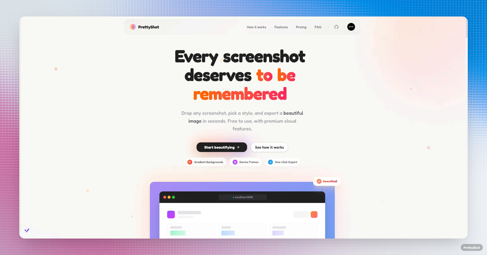

  

<h1 align="center">PrettyShot</h1>

  <strong>Every screenshot deserves to be remembered.</strong>

  Drop any screenshot, pick a style, and export a beautiful image in seconds. 
  Free, open source, and runs entirely in your browser.

  
  
  

---

## Features

- **Gradient Backgrounds** - 12 handcrafted gradients, mesh images, solid colors, or upload your own
- **Rich Shadows** - 7 shadow presets with full color picker
- **Noise Texture** - Add grain to backgrounds for a premium, tactile feel
- **3D Perspective** - Tilt, rotate, and angle screenshots for dynamic hero shots
- **Aspect Ratios** - Auto, 16:9, 4:3, 1:1, or 9:16
- **HD Export** - PNG or JPG at 1x, 2x, or 3x scale
- **Clipboard Copy** - One click to copy, paste anywhere
- **Zero Signup** - No account, no email, no watermark. Just open and create

## Contributing

Contributions are welcome! Feel free to open an issue or submit a pull request.

1. Fork the repository
2. Create your branch (`git checkout -b feature/amazing-feature`)
3. Commit your changes (`git commit -m 'Add amazing feature'`)
4. Push to the branch (`git push origin feature/amazing-feature`)
5. Open a Pull Request

## License

This project is open source and available under the [MIT License](LICENSE).

## Author

Made with love by [PRAS Samin](https://github.com/prassamin)
