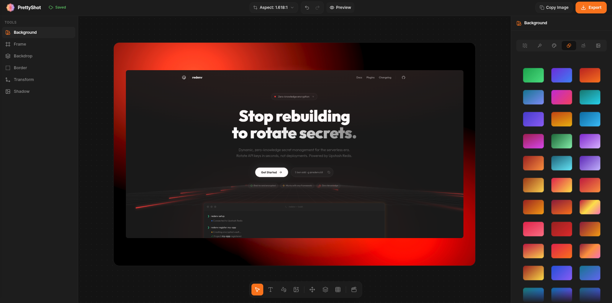

<p align="center">
  
</p>

<h1 align="center">PrettyShot</h1>

<p align="center">
  <strong>Every screenshot deserves to be remembered.</strong>
</p>

<p align="center">
  A screenshot-first design studio that runs in the browser.<br/>
  Drop a capture, frame it in a real device, light the stage, and export a product shot in seconds.
</p>

<p align="center">
  <a href="https://github.com/prassamin/prettyshot/blob/main/LICENSE"></a>
  <a href="https://github.com/prassamin/prettyshot/issues"></a>
</p>

---

## What is PrettyShot?

PrettyShot is a **web-based studio for making screenshots look like product shots**. It is not a generic photo editor — every tool exists to take a plain capture and turn it into something you'd be proud to ship on a landing page, a store listing, or a social post.

The whole editor runs in your browser. Images are processed client-side; nothing is uploaded unless you choose to sync with the cloud.

---

## Features

### Canvas & content
- **Device frames** — iPhone, iPad, MacBook and desktop frames with true screen geometry, color variants, and portrait/landscape orientation
- **Browser frames** — Safari and Chrome windows with an editable address bar
- **Backgrounds** — solid, linear, mesh and aurora backdrops, plus auto palettes sampled from your own screenshot's colors
- **Multiple screenshots** — compose two or three captures in one canvas
- **Aspect ratios** — standard presets, social platform presets (X, Instagram, YouTube, LinkedIn, TikTok, Pinterest…) and custom sizes

### Polish
- **3D tilt & layout** — rotate any shot in space, control inset and canvas radius
- **Shadows** — drop, soft, hard, glow, float and layered projection styles with a light-direction pad
- **Borders, grain, lighting & filters** — physical-feeling finishes on top of the frame
- **Annotations & text** — labels, callouts, arrows, freehand ink and image assets, all editable after you draw them

### Motion & export
- **Animation timeline** — clip-based keyframes with easing; animate zoom, tilt, shadows, backgrounds and more
- **Stills** — PNG, JPEG or WebP up to 8K, or copy straight to the clipboard
- **Video** — MP4 / WebM up to 4K, rendered frame-by-frame in the browser

### Privacy & sync
- **Local-first** — free designs autosave to your device (IndexedDB); images never leave the browser
- **Cloud sync** — Pro designs follow you across devices via Supabase + Cloudinary

---

## Tech stack

- **Framework** — [Next.js 16](https://nextjs.org) (App Router, Turbopack) + TypeScript
- **UI** — [HeroUI v3](https://heroui.com), [Tailwind CSS v4](https://tailwindcss.com), [Framer Motion](https://motion.dev), [GSAP](https://gsap.com) (scroll-driven landing)
- **Editor engine** — custom DOM/CSS composition with CSS-variable preview tokens; static-clone export pipeline
- **Backend**
  - [Supabase](https://supabase.com) — Postgres (profiles, designs), Auth, Storage
  - [Upstash Redis](https://upstash.com) — frame/background catalog metadata
  - [Cloudinary](https://cloudinary.com) — image CDN + frame/background asset library
  - [Polar](https://polar.sh) — merchant of record for the lifetime license

---

## Getting started

```bash
# 1. Install
bun install        # or npm install / pnpm install

# 2. Environment — copy .env.example into .env and fill in your keys
cp .env.example .env

# 3. Run the dev server
bun dev
```
> **Local mode:** with `DISABLE_PAID = true` in `src/config/index.ts`, every Pro feature is unlocked without a license — handy for development.

---

## Feature gating

Every paywalled capability is registered in [`src/config/features.ts`](src/config/features.ts). Components read it through `useFeatureGate`; locks render tooltips and redirect to `/checkout` or `/login`. Flipping a tier in that one file updates the editor everywhere.

---

## Contributing

Contributions are welcome! Feel free to open an issue or submit a pull request.

1. Fork the repository
2. Create your branch (`git checkout -b feature/amazing-feature`)
3. Commit your changes (`git commit -m 'Add amazing feature'`)
4. Push to the branch (`git push origin feature/amazing-feature`)
5. Open a Pull Request

---

## License

This project is open source and available under the [MIT License](LICENSE).

## Author

Made with ❤️ by [PRAS Samin](https://github.com/prassamin)
